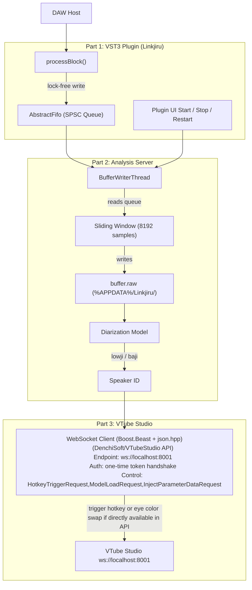

# Architecture??

## Proposed System Design


# Building the VST & VST3

## Prerequisites

- CMake 3.22+
- C++ compiler (MSVC only please)
- Remember to git submodule for JUCE and VST2.4 SDK: `git submodule update --init --recursive`

## Configure
### From home . folder
```bash
cd cpp_impl
cmake -B build -DCMAKE_BUILD_TYPE=Release
```

With Ninja (faster builds):

```bash
cmake -B build -G Ninja -DCMAKE_BUILD_TYPE=Release
```

```bash
cmake --build build --config Release --target BuildAll
```

## Artifacts

After building, outputs are copied to `cpp_impl/artifacts/`:

- `artifacts/Linkjiru.vst3/` — VST3 bundle
- `artifacts/Linkjiru.dll` — VST2 plugin

# Watching numbers move

Run the VST/VST3 and hit start analysis, then run the command below in a Powershell window (no need for admin rights)

``` Powershell
while($true) { $b = [System.IO.File]::ReadAllBytes("$env:APPDATA\Linkjiru\buffer.raw"); $f = [float[]]::new($b.Length/4);
  [System.Buffer]::BlockCopy($b,0,$f,0,$b.Length); Clear-Host; $f[0..15] -join "`n"; Start-Sleep -Milliseconds 200 }
```

## Caveats for Development

Currently the plugin writes to a file on windows (the target deployment OS -- i.e windows -- at file location %APPDATA%/Linkjiru/buffer.raw [C:\Users\yourpcname\AppData\Roaming\Linkjiru\buffer.raw])
- I haven't thought as far as details like what if we have to monitor two separate audio sources for detection (causing overwrite errors)
- Thus, no reason to clean up the file after instance is closed. File persists since currently it is only 32KB = 8192 samples x 32 bit float (4 byte)