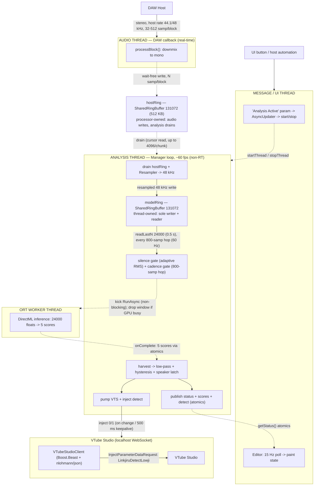

# Architecture

A VST3/Standalone plugin captures audio, an in-process analysis thread runs an ONNX
speaker model on it, and the result drives a VTube Studio parameter.

## System Design


```mermaid
flowchart TD
    DAW["DAW Host"]
    CTRL["UI button / host automation"]

    subgraph AUD["AUDIO THREAD — DAW callback (real-time)"]
        PB["processBlock(): downmix to mono"]
    end

    HR["hostRing — SharedRingBuffer 131072 (512 KB)<br/>processor-owned: audio writes, analysis drains"]

    subgraph ANA["ANALYSIS THREAD — Manager loop, ~60 fps (non-RT)"]
        RS["drain hostRing + Resampler -> 48 kHz"]
        MR["modelRing — SharedRingBuffer 131072<br/>thread-owned: sole writer + reader"]
        GATE["silence gate (adaptive RMS) + cadence gate (800-samp hop)"]
        HARV["harvest -> low-pass + hysteresis + speaker latch"]
        VP["pump VTS + inject detect"]
        PUB["publish status + scores + detect (atomics)"]
    end

    subgraph ORTT["ORT WORKER THREAD"]
        INF["DirectML inference: 24000 floats -> 5 scores"]
    end

    subgraph MSG["MESSAGE / UI THREAD"]
        RECON["'Analysis Active' param -> AsyncUpdater -> start/stop"]
        ED["Editor: 15 Hz poll -> paint state"]
    end

    subgraph VTSG["VTube Studio (localhost WebSocket)"]
        WS["VTubeStudioClient (Boost.Beast + nlohmann/json)"]
        VTS["VTube Studio"]
    end

    DAW -->|"stereo, host rate 44.1/48 kHz, 32-512 samp/block"| AUD
    PB -.->|"wait-free write, N samp/block"| HR
    HR -.->|"drain (cursor read, up to 4096/chunk)"| ANA
    RS -->|"resampled 48 kHz write"| MR
    MR -->|"readLastN 24000 (0.5 s), every 800-samp hop (60 Hz)"| GATE
    GATE -.->|"kick RunAsync (non-blocking); drop window if GPU busy"| ORTT
    INF -.->|"onComplete: 5 scores via atomics"| HARV
    HARV --> VP
    HARV --> PUB
    VP -->|"inject 0/1 (on change / 500 ms keepalive)"| VTSG
    WS -->|"InjectParameterDataRequest: LinkjiruDetectLowji"| VTS

    CTRL --> MSG
    RECON -.->|"startThread / stopThread"| ANA
    PUB -.->|"getStatus() atomics"| ED
```

Dashed edges cross a thread boundary and are **lock-free**: a ring buffer (wait-free) or a published atomic. Solid edges run within a single thread. The audio thread is the only real-time one; everything else runs off it.

`LinkjiruProcessor` (the plugin) owns `hostRing`: the audio thread writes it, so it must outlive a torn-down manager. The `AnalysisThread` owns `modelRing` and the `Resampler`. It is the sole writer and reader of `modelRing`, so nothing else can touch it and each session gets a fresh empty ring. The thread drains `hostRing`, resamples to 48 kHz into `modelRing`, and reads 0.5 s windows for the model.

## VTS injects are fire-and-forget

The AnalysisThread tracks the VTS connection and registration from real responses (`ParameterCreationResponse` / `APIError`) that it reads and surfaces to the UI. The per-frame detect inject is deliberately fire-and-forget: `InjectParameterDataResponse` is drained and ignored, and only a socket-level write error drops the connection. Acking each inject would buy nothing: a dropped one is self-correcting (the next frame overwrites the value, and a 500 ms keepalive re-sends the current one), so tracking it would only add latency and state.

## Don't reintroduce AbstractFifo

`juce::AbstractFifo` is single-consumer, so it can't feed both the writer and the `AnalysisThread`. The old workaround (both threads sharing a `buffer.raw` file) tore reads apart (`loadFileAsData()` isn't atomic; you get half-old/half-new samples with no error). `SharedRingBuffer` fixes it: `processBlock()` writes with one atomic counter bump, and any number of readers snapshot or cursor-read without consuming. Need another reader? Give it a cursor and don't bring back AbstractFifo.

# Building

## Prerequisites

- CMake 3.22+, MSVC (Windows only)
- JUCE submodule: `git submodule update --init --recursive`
- A DirectML-capable (DX12) GPU to run detection
- The model file (see below)

Boost, nlohmann/json, and ONNX Runtime (DirectML) are fetched by CMake; no manual install. The first configure is slower, then cached.

## Model file (required for the plugin)

`onnx-model/runtime_model.onnx` is **not in the repo** (too large, gitignored). A fresh clone therefore **cannot build the plugin**: the post-build step copies the model next to each binary and fails if it's missing. **Request it separately** and place it at `cpp_impl/onnx-model/runtime_model.onnx`. The unit tests don't need it.

## Build

```bash
cd cpp_impl
cmake -B build -G Ninja -DCMAKE_BUILD_TYPE=Release
cmake --build build --config Release --target BuildAll   # plugin (VST3 + Standalone) + unit tests
```

Unit tests only, no model, GPU, JUCE, or ONNX Runtime (this is what CI runs):

```bash
cmake -B build -G Ninja -DCMAKE_BUILD_TYPE=Release -DLINKJIRU_UNIT_TESTS_ONLY=ON
cmake --build build --target LinkjiruUnitTests
```

The VST3 bundle lands in `artifacts/Linkjiru.vst3/`; the Standalone app under the build tree. VST3 + Standalone only, no VST2.

# VTube Studio

The plugin drives a `LinkjiruDetectLowji` (0/1) parameter in VTS over WebSocket.

1. **Start Analysis**: captures audio, detects speech, and connects + authenticates to VTS in the background (retries every 5 s).
2. **Register in VTS**: once connected (status yellow), click to create the parameter in VTS.
3. After registration, the plugin pushes the detect value to VTS; map `LinkjiruDetectLowji` in VTS's parameter settings.

- **First-run auth:** approve the "Linkjiru" popup in VTS; the token is DPAPI-encrypted at `%APPDATA%\Linkjiru\vts_token.dat` (once only).
- **Reconnect:** if VTS restarts, the plugin reconnects in ~5 s. Re-register, since VTS forgets custom params on restart.
- **No VTS:** everything still runs; nothing breaks.

# Development notes

The whole pipeline is lock-free: wait-free rings, atomics for cross-thread status, no mutexes anywhere. `VTubeStudioClient` needs none because only the AnalysisThread's `pump()` ever drives it, so Boost.Beast's non-thread-safe WebSocket stream is never touched concurrently.

# Before You Commit

From `cpp_impl/`:

1. **Lint:** `cd sanity && .\run_lint.ps1` (`-Fix` to auto-format).
2. **Unit tests:** `cmake --build cmake-build-release --target LinkjiruUnitTests`, then run `cmake-build-release\tests\Release\LinkjiruUnitTests.exe`. Pure C++, no GPU/model; the whole suite, and what CI runs.
3. **Plugin build:** `cmake --build cmake-build-release --target BuildAll --config Release` (needs the model file). Verify `artifacts/Linkjiru.vst3`.
